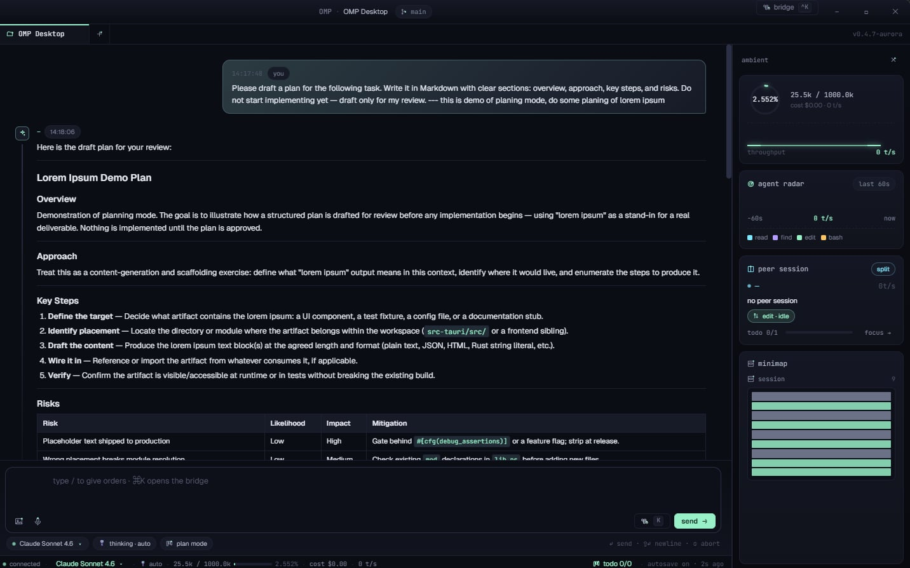
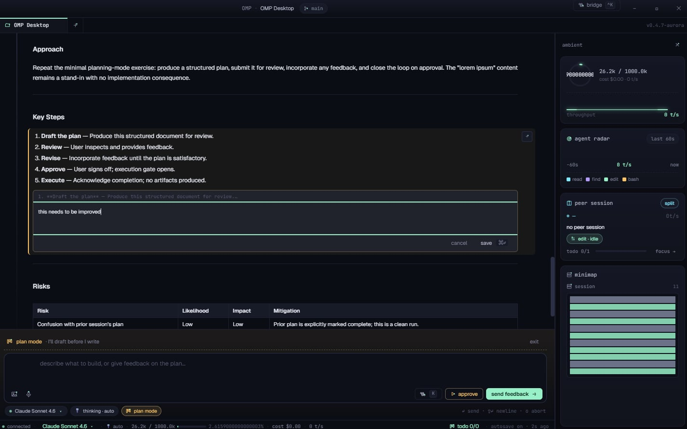
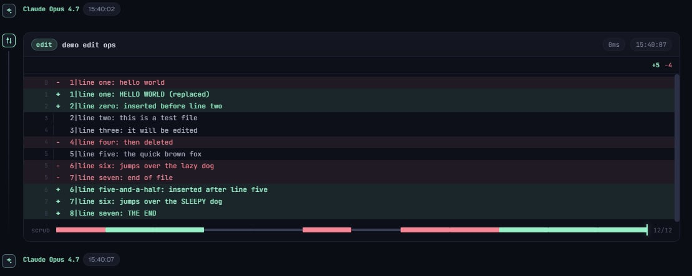

# Oh My Pi Desktop

A Tauri 2 desktop shell for [oh-my-pi](https://github.com/can1357/oh-my-pi) (`omp`).
Wraps the `omp --mode rpc` coding agent as a managed child process and serves the
React UI as a connected, live interface — no browser, no Electron, ~8 MB binary.

## Features

**Chat & sessions**
- Per-tab session isolation — each tab owns its own `omp --mode rpc` process
- Full session snapshots: switch tabs, state is preserved including in-flight streams
- `/new` command starts a fresh session (history kept on disk)
- Model picker with two-view command bridge; cycle or pick directly from the status bar
- Thinking-level control: cycle through `off / minimal / low / medium / high / xhigh` (per-model — omp picks the supported subset)
- Streaming token display with tokens/sec sparkline and context-window gauge

**Plan mode**
- Activates a draft-before-write workflow entirely in the chat window
- First message is wrapped in an intent framing prompt; subsequent sends steer the plan
- Inline plan annotations: click any paragraph to leave a comment before approving
- Approve button sends all annotations as a single feedback prompt and opens the kanban
- Kanban panel auto-populates from the agent's `todo_write` tool calls (running / done)

**Tool cards**
- Live streaming output for `eval` (JS/Python kernel) and `bash` tool calls
- Syntax-highlighted code blocks (highlight.js, atom-one-dark) once a cell completes
- Scrubbable unified diff viewer for `edit` calls with animated line reveal
- Search preview, read summary, task board for the respective tools
- Distinct icon + color per tool type: read, search, edit, bash, eval, task, debug, ask

**Minimap**
- Dense cell grid (one cell per message) replacing the old bar stack — fits 200+ messages
- Token heatmap: assistant cells brightness log-scaled by tokens used
- Hover a cell → corresponding chat bubble highlights with an accent ring
- Click a cell → chat scrolls smoothly to that message
- Tooltip shows role, token count (in/out), tool name, duration, or message preview

**Native shell**
- Tauri 2, Rust backend, no Electron, no CDN dependencies
- Frameless window with custom traffic-light / drag region on Windows and macOS
- Native folder picker for opening projects
- Strict CSP; asset protocol disabled; no shell plugin surface





---

## Architecture

```
┌─────────────────────────────────────────────────────┐
│  Tauri WebView  (src/)                              │
│                                                     │
│  app-live.jsx ──► OMP_BRIDGE ──► live.js            │
│       │                │                            │
│  React state    RPC event handlers                  │
│  (messages,     (turn, message, tool,               │
│   model, ctx,    extension_ui, sparkline)           │
│   kanban…)             │                            │
│                  adapter.js (pure transforms)       │
└────────────────────────┬────────────────────────────┘
                         │  Tauri IPC (invoke / events)
┌────────────────────────▼────────────────────────────┐
│  Rust  (src-tauri/src/)                             │
│                                                     │
│  AgentBridge                                        │
│    spawn  omp --mode rpc                            │
│    stdin  ◄── send_command (JSON lines)             │
│    stdout ──► agent://line events (JSON lines)      │
│    kill   on drop / stop_session / hot-reload         │
└────────────────────────┬────────────────────────────┘
                         │  stdin / stdout pipes
┌────────────────────────▼────────────────────────────┐
│  omp  (oh-my-pi coding agent)                       │
│    JSON-line RPC protocol                           │
│    streams AgentSessionEvents to stdout             │
└─────────────────────────────────────────────────────┘
```

---

## Requirements

| Tool | Version |
|------|---------|
| [Rust](https://rustup.rs/) | stable (1.77+) |
| [Node.js](https://nodejs.org/) | 18+ |
| [Tauri CLI](https://tauri.app/start/prerequisites/) | 2.x (`npm install`) |
| [oh-my-pi](https://github.com/can1357/oh-my-pi) | 14.8+ (`omp` in PATH) |

`omp` must be reachable as `omp` on your `PATH`. On Windows it is typically
installed at `%LOCALAPPDATA%\omp\omp.exe` and added to PATH by the installer.

---

## Getting Started

```bash
# Clone
git clone https://github.com/yourname/omp-desktop
cd omp-desktop

# Install Tauri CLI (dev dependency only)
npm install

# Dev mode — hot-reloads frontend, rebuilds Rust on backend changes
npm run dev

# Production build
npm run build
```

Dev mode auto-opens the WebView DevTools in debug builds.

---

## Project Structure

```
omp-desktop/
├── src/                        # Frontend (served by Tauri asset server)
│   ├── index.html              # Entry point — declares script load order
│   ├── app-live.jsx            # React root: state + handlers + render
│   ├── live.js                 # Tauri IPC bridge + OMP_BRIDGE + OMP_DATA
│   ├── adapter.js              # Pure RPC→UI data transforms (no side effects)
│   ├── model-names.js          # Model ID → display name lookup table
│   ├── platform.css            # Tauri-native overrides (no padding/shadow/radius)
│   ├── react.development.js    # React 18 (local, no CDN)
│   ├── react-dom.development.js
│   ├── babel.min.js            # @babel/standalone for JSX transform
│   ├── marked.min.js           # Markdown renderer
│   ├── highlight.min.js        # Syntax highlighting (atom-one-dark theme)
│   ├── highlight-theme.css
│   │
│   ├── app/                    # App-root helpers (extracted from app-live.jsx)
│   │   ├── constants.js        # TWEAK_DEFAULTS, NULL_MODEL, framing strings
│   │   └── use-bridge-snapshot.jsx  # Custom hooks: bridge subscription, theme, ⌘K
│   │
│   └── design/                 # UI components, split by domain
│       ├── ui/
│       │   ├── icons.jsx           # OMP Icon Pack v1 + TOOL_META
│       │   ├── sparks.jsx          # Sparkline, TokenGauge, ActivityRadar
│       │   ├── markdown.jsx        # MarkdownContent (marked + hljs)
│       │   └── plan-annotations.jsx # AnnotablePlan + CommentForm
│       ├── chat/
│       │   ├── user-bubble.jsx
│       │   ├── assistant-bubble.jsx # AssistantBubble + InlinePlan
│       │   ├── eval-cell.jsx        # Syntax-highlighted kernel cell
│       │   ├── tool-card.jsx        # ToolCard + ScrubbableDiff
│       │   └── chat-view.jsx        # Auto-scroll wiring + bubble routing
│       ├── tweaks/
│       │   ├── style.js             # __TWEAKS_STYLE template
│       │   ├── use-tweaks.js        # useTweaks hook
│       │   ├── panel.jsx            # TweaksPanel + TweakSection + TweakRow
│       │   └── controls.jsx         # Slider/Toggle/Radio/Select/etc.
│       ├── layout/                  # CSS by visual layer (chained @import)
│       │   ├── _index.css
│       │   ├── chrome.css           # App + window chrome + Tabs
│       │   ├── stage.css            # Stage layout + session column
│       │   ├── chat.css             # Chat surface, inline plan, tool cards
│       │   ├── composer.css         # Composer + slash palette
│       │   ├── rail.css             # Status bar + ambient rail + minimap
│       │   └── overlays.css         # ⌘K bridge + kanban + plan annotations
│       ├── chrome.jsx               # WindowChrome, TabBar, StatusBar, AmbientRail, SessionMinimap
│       ├── composer.jsx             # Composer + CommandBridge (⌘K palette)
│       ├── panels.jsx               # PlanKanban (kanban view)
│       ├── layout.css               # Single @import → layout/_index.css
│       └── styles.css               # Visual tokens (colours, spacing, type)
│
├── src-tauri/                  # Rust backend
│   ├── src/
│   │   ├── main.rs             # Binary entry point
│   │   ├── lib.rs              # Tauri setup, command registration
│   │   └── agent/              # AgentBridge module
│   │       ├── mod.rs              # Public surface: AgentBridge struct + impl
│   │       ├── inner.rs            # BridgeInner per-session record
│   │       ├── spawn.rs            # spawn_omp + Windows CREATE_NO_WINDOW flag
│   │       └── reader.rs           # stdout/stderr reader threads, read_until_capped
│   ├── Cargo.toml
│   ├── tauri.conf.json         # Window config + strict CSP
│   └── capabilities/
│       └── default.json        # Tauri capability grants
│
├── docs/
│   └── plans/                  # Design documents
├── screenshots/                # README assets
├── test-rpc.mjs                # Dev utility: probe omp RPC directly (Node/Bun)
├── .gitattributes
├── .gitignore
├── README.md
├── CLAUDE.md
└── package.json
```

---

## RPC Protocol

The frontend communicates with `omp` exclusively through the Tauri IPC bridge.
`live.js` sends JSON commands via `invoke("send_command", { sessionId, json })` and
`agent://line` events emitted by the Rust stdout reader.

### Commands sent (stdin → omp)

| Command | When |
|---------|------|
| `get_state` | On `ready`, after each `turn_end` |
| `get_messages` | On `ready` |
| `get_available_models` | On `ready` |
| `prompt` | User sends a message |
| `abort` | User clicks abort |
| `set_model` | User picks a model in ⌘K bridge |
| `cycle_model` | User clicks `/model` command |
| `cycle_thinking_level` | User cycles thinking in composer / `/thinking` |
| `compact` | User runs `/compact` |
| `export_html` | User runs `/export` |
| `get_session_stats` | After each `turn_end` |
| `extension_ui_response` | Auto-cancel for interactive UI requests |

### Events received (stdout → frontend)

| Event | Handler |
|-------|---------|
| `ready` | Bootstraps initial data fetches |
| `turn_start` / `turn_end` | Streaming state, TPS calculation, cost accumulation |
| `message_start` | Creates user/assistant bubbles; stamps model name |
| `message_update` | Updates streaming bubble from accumulated content |
| `message_end` | Finalises bubble (`streaming: false`) |
| `tool_execution_start` | Creates running tool card |
| `tool_execution_end` | Finalises tool card with result/diff/output |
| `extension_ui_request` | Interactive types auto-cancelled; others ignored |
| `agent_start` / `agent_end` | Re-fetches session state |

---

## Key Design Decisions

**`omp --mode rpc` not `omp --rpc`** — `--rpc` is not a valid flag; omp falls through to
interactive TUI mode and outputs ANSI escape codes instead of JSON. Confirmed from source.

**Blank line = skip, not EOF** — The Rust stdout reader originally used `_ => break` for
both empty lines and IO errors; one blank line from omp killed the reader thread silently.
Now `Ok("") => continue`, `Err(_) => break`.

**`AgentBridge` kills child on drop** — Stores `Child` alongside stdin. `drop`, `stop_inner`,
and the beginning of `start` all call `child.kill() + child.wait()` so hot-reloads and
tab closes leave no orphaned `omp` processes.

**Event delegation for window controls** — `WindowChrome` is painted by React after
`DOMContentLoaded`. `querySelector` at that point finds nothing. All window control
clicks are caught by a single delegated listener on `document`.

**`set_model` response must be handled** — Without it, `state.model` stays stale. The next
`turn_start` calls `notify()` which pushes the old model back to React, reverting the
display mid-turn. The response is now handled and calls `notify()` immediately.

**Model list above commands in ⌘K bridge** — With 8 command rows, the model section was
below `max-height: 60vh` and invisible without scrolling. Models now render first.

---

## Tauri Commands

| Command | Signature | Description |
|---------|-----------|-------------|
| `start_session`   | `(sessionId: String, cwd: String) → Result<()>` | Spawn omp for a new tab session (`cwd: ""` = omp default) |
| `stop_session`    | `(sessionId: String) → ()`                       | Kill that tab's omp process and reap it off-thread |
| `send_command`    | `(sessionId: String, json: String) → Result<()>`| Write a JSON line to that session's omp stdin |
| `session_status`  | `(sessionId: String) → Option<String>`           | Returns cached startup error if the last `start_session` failed |
| `open_project`    | `() → Result<Option<String>>`                   | Native folder picker dialog |

---

## Frontend State Flow

```
omp stdout
  └─► agent://line Tauri event
        └─► handleLine(rawLine)
              ├─► _handleResponse(resp)   — RPC responses
              │     ├── get_state         → _applyRpcState() → notify()
              │     ├── get_available_models → state.models → notify()
              │     ├── set_model         → state.model + current flags → notify()
              │     └── cycle_model       → state.model + thinkingLevel → notify()
              └─► _handleEvent(ev)        — AgentSessionEvents
                    ├── turn_start/end    → isStreaming, TPS, cost
                    ├── message_*         → streamingBubble lifecycle
                    ├── tool_execution_*  → tool cards
                    └── extension_ui_request → auto-cancel interactive

notify()
  ├─► subscribers (OMP_BRIDGE.onUpdate callbacks)
  │     └─► React setState calls in app-live.jsx
  └─► window.OMP_DATA sync (for components reading globals directly)
```

---

## Tweaks

Open the Tweaks panel (the floating panel in the bottom-right) to adjust:

| Setting | Options |
|---------|---------|
| Theme | aurora · phosphor · daylight |
| Density | cozy · compact · dense |
| Accent colour | 6 presets + custom |
| Mono chat font | toggle |
| Layout | rail · split · focus |

---

## Development Notes

**`test-rpc.mjs`** — Standalone Bun/Node script that spawns `omp --mode rpc` directly
and exercises the protocol. Useful for verifying RPC behaviour without the full UI.

**No CDN dependencies** — React 18, ReactDOM, and Babel standalone are bundled locally
under `src/`. The app works fully offline.

**`src/design/`** — Modified copy of the original `design/` prototype. The original
`design/` directory is excluded from the repo (`.gitignore`); `src/design/` is committed
and is the authoritative source. Do not regenerate from `design/` — that would overwrite
the live-wiring changes.

**Windows 11 target** — Uses `color-mix(in oklab, …)` which requires WebView2 ≥ 101
(Windows 11 default). The frameless window (`decorations: false`) relies on DWM for
corner rounding.
