# OMP Desktop

A native desktop app for [oh-my-pi](https://github.com/can1357/oh-my-pi) (`omp`), the terminal coding agent.
Every tab runs its own `omp` process in RPC mode; the app shows what the agent is doing as it happens: streamed replies, tool calls, diffs, subagents, plans and what it costs.
Built on Tauri 2 (Rust + the system webview). It doesn't bundle Electron, doesn't load anything from a CDN, and needs no browser.

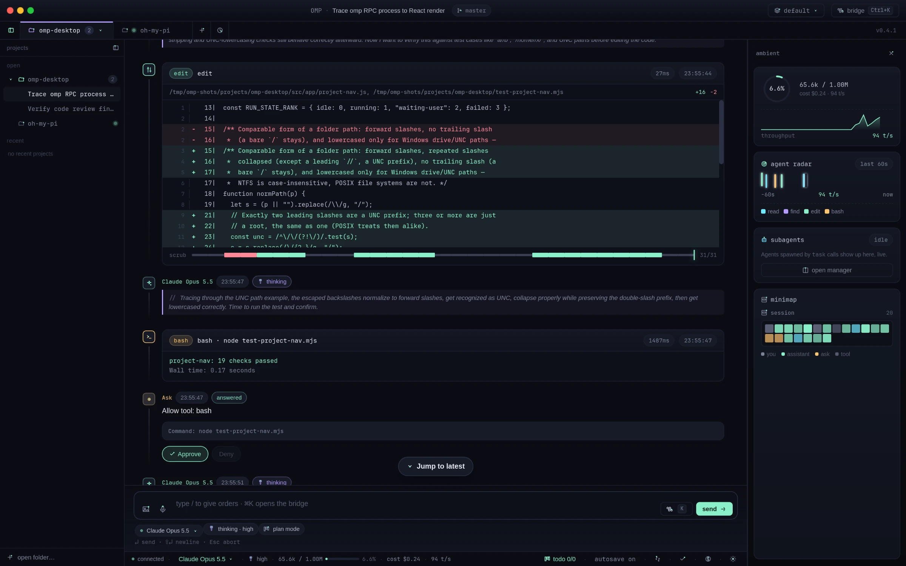

## Contents

- [Features](#features)
- [Install](#install)
- [Usage](#usage)
- [Development](#development)
- [Architecture](#architecture)
- [License](#license)

## Features

### Projects and tabs

- **One tab = one agent.** Each tab is its own `omp` process, with its own working folder and profile. Switching tabs keeps in-flight turns streaming in the background.
- **Project sidebar** (`Ctrl+B`): open tabs grouped by project, plus recently opened folders. Tabs on the same folder collapse into one tab-bar chip with a dropdown.
- **Named conversations.** A new tab starts under its folder name and renames itself to the conversation's generated title once the first exchange ends. A `/rename` you type always wins.
- **Conversation history** (`Ctrl+H`): search and resume saved sessions. If the conversation is already open in a tab, that tab is focused instead of opening it twice.
- **Open with OMP Desktop.** Open a folder from Finder, Explorer or your Linux file manager, or run `omp-desktop /path/to/project`. If the app is already running, the folder opens as a new tab in the existing window.
- **Welcome screen.** With no tab open, the app shows a welcome screen and doesn't run any agent until you open a project.

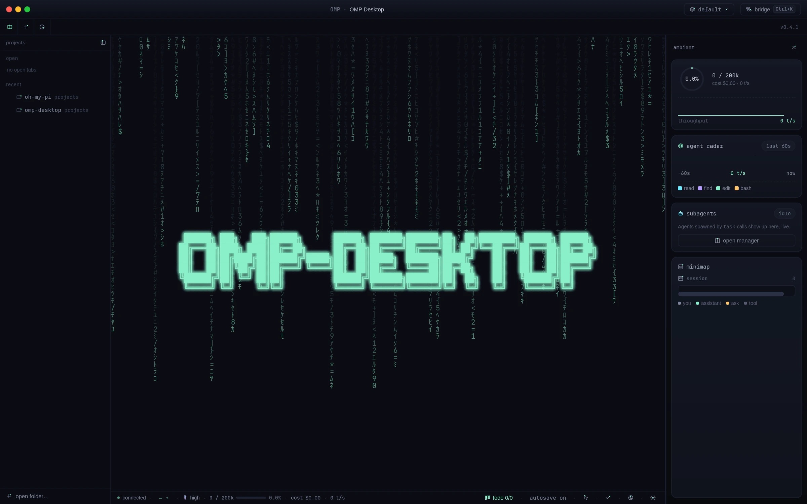

### Watching the agent work

- **Tool cards** for every call: `read`, `grep`, `bash`, `eval` (JS/Python kernel cells), `edit`, `task` and more. Output streams live, code is syntax-highlighted, and edit diffs have a scrubber.
- **Approvals.** Sessions start in `--approval-mode write`, so exec-tier tools ask first. Answer *Approve*, *Allow for this session* or *Always allow in this project*, and review or revoke the saved rules in the approval-rules panel.
- **Ambient rail.** Shows the context-window gauge, cost, a tokens/sec sparkline, an agent radar of recent tool activity, and a minimap of the session. Click a minimap cell to jump to that message.
- **Subagent manager.** Agents started by a `task` call appear in the rail as they run. Open the manager to get totals, a swimlane timeline, agents grouped by the task call that spawned them, and an inspector for each agent's assignment, tools, output and transcript.

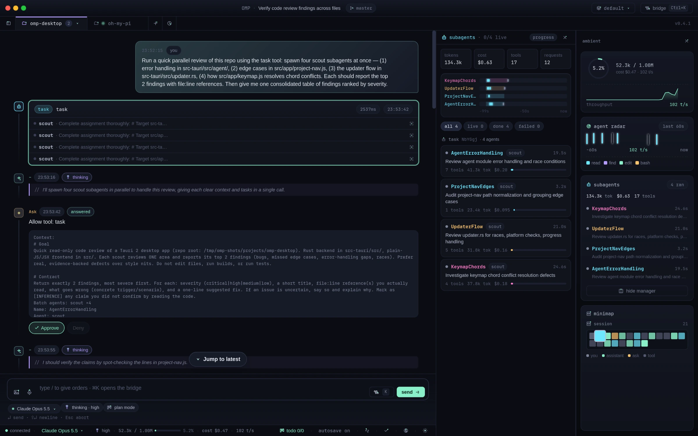

### Plan mode

Toggle plan mode (`Shift+Alt+P`, `/plan` or the composer pill) and the agent drafts a plan before touching any files. Click any block of the plan to comment on it; your comments go back with the next *send feedback*, and *approve* lets the agent start. The agent's todo list fills the kanban (`/todo`).

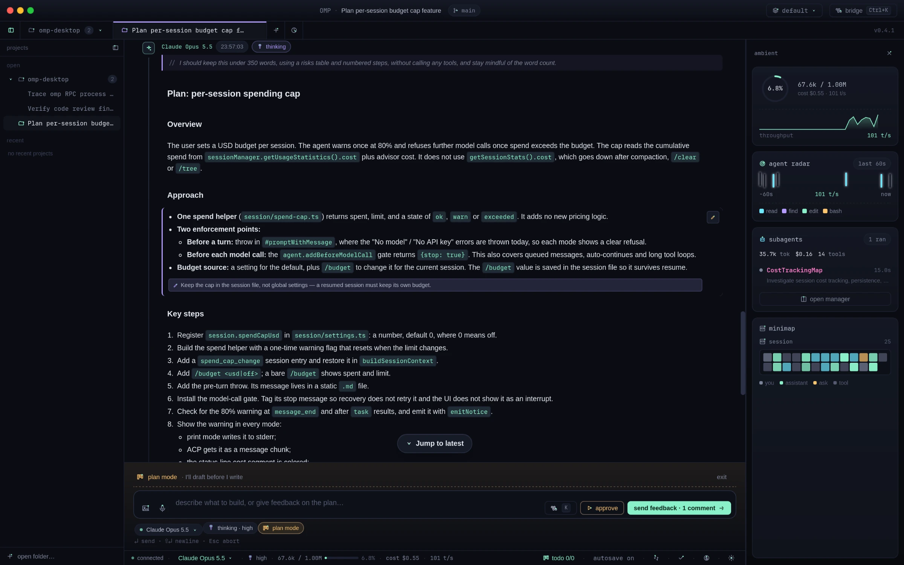

### Composer

- `/` opens a palette with the desktop commands plus every omp slash command and skill discovered for the tab.
- `@` autocompletes project file paths.
- Attach images from a file picker or paste them from the clipboard. Click an attached image to view it full size.
- Prompt history: `↑`/`↓` recalls earlier prompts, and `Ctrl+↑` opens a searchable picker.
- Send while the agent is working to *steer* the current turn, or queue a follow-up with `Ctrl+Enter`.
- Model picker and thinking level (`off · minimal · low · medium · high · xhigh`) are available from the composer, the status bar, or the keyboard.

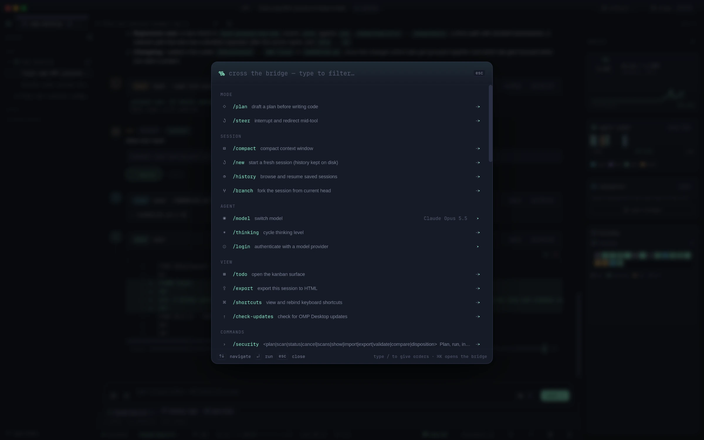

### Panels

| | |
|---|---|
| **Changes**: `git status`/`git diff` for the tab's project, with per-file accept and reject | **Usage**: requests, cost, tokens and throughput for the last 24 h, by model, folder and agent type (from `omp stats`) |
| 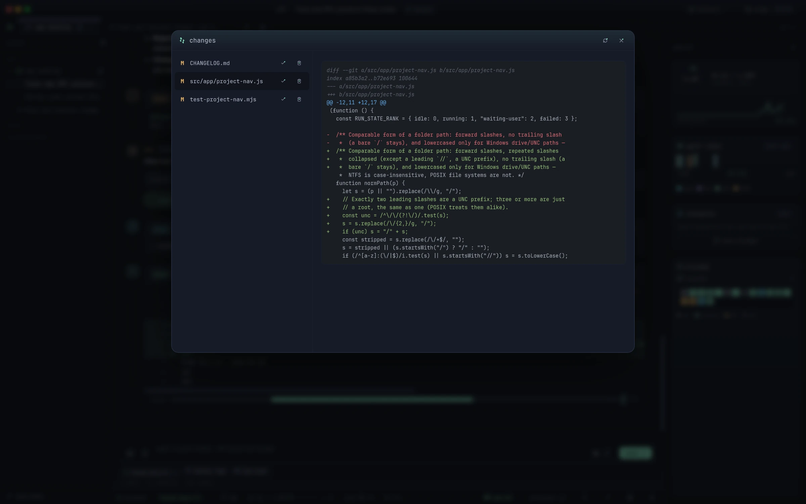 | 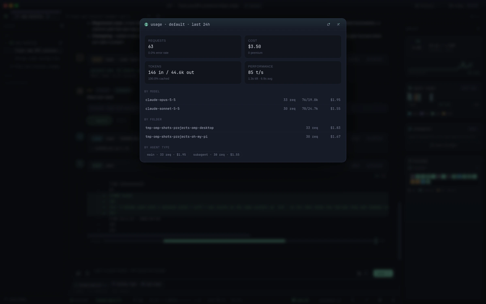 |
| **History**: saved conversations for the tab's profile, searchable and resumable | **Shortcuts** (`Ctrl+/`): every action with its chord; rebind, add a second chord, or reset |
| 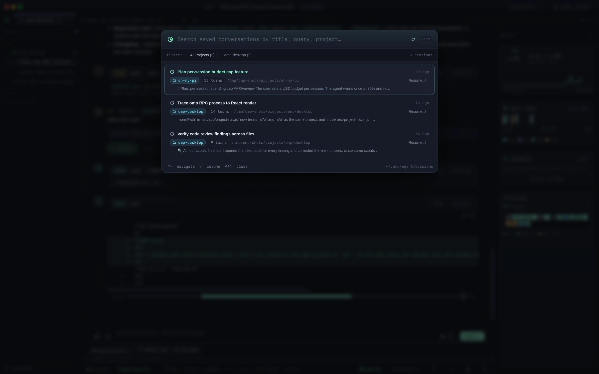 | 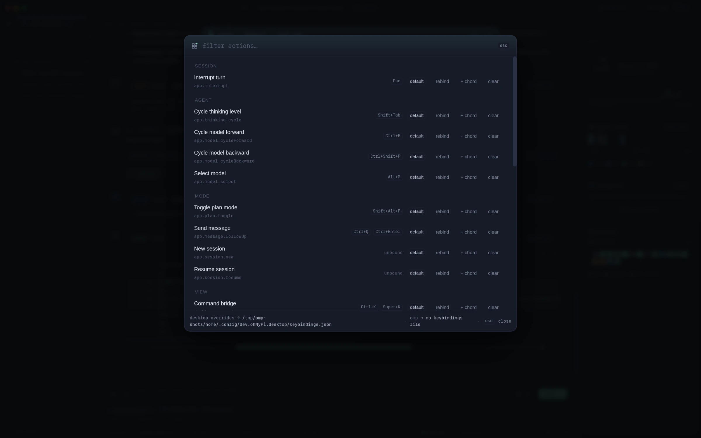 |

### Profiles, updates, look

- **Profiles.** A tab can run under an omp profile (`omp --profile <id>`) with its own auth, sessions, settings and caches. Create, rename and switch profiles from the title bar, and tick one as the startup default. A new profile boots far enough to run `/login`.
- **In-app updates.** The app checks the signed release feed 15 s after launch and every 6 h after that. Windows, macOS and the Linux AppImage install updates themselves and relaunch. `.deb`/`.rpm` and source builds show a notice with a link to the release instead.
- **Tweaks panel** (status bar): theme (`aurora`, `phosphor`, `daylight`), density, accent colour, mono chat font, font size, layout (`rail`, `split`, `focus`) and prompt-history size.

| phosphor | daylight |
|---|---|
| 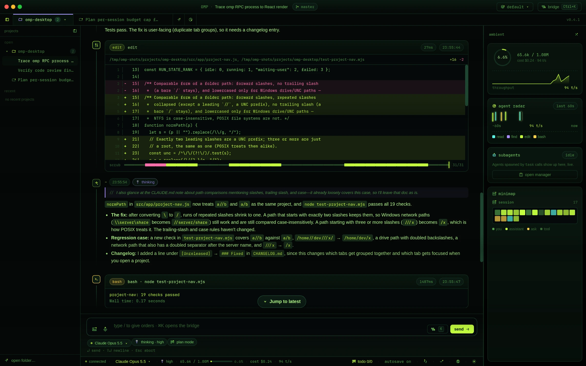 | 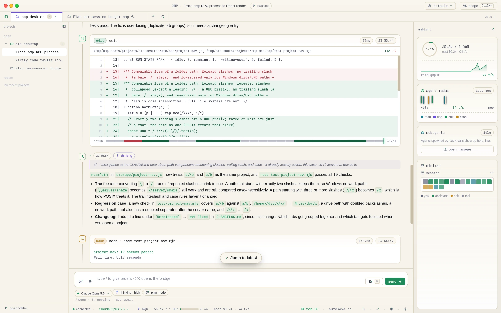 |

### Security

- Agent output is rendered as Markdown, with any raw HTML escaped. Links open in your system browser, and `javascript:`/`data:` links are rendered as plain text.
- Release builds use a strict Content Security Policy: no inline scripts, no `eval`, the asset protocol off and the shell plugin removed.
- Tokens, API keys and auth headers are redacted from agent output and logs.
- Closing a tab or quitting kills the agent's whole process tree, so no orphaned subagents or tool processes are left behind.

## Install

### Requirements

`omp` must be installed and on your `PATH` (on Windows it is usually `%LOCALAPPDATA%\omp\omp.exe`). Each release needs a recent omp: a tab started against an older one does not start, and its message names the version required (`omp update` fixes it). On macOS, GUI apps get a minimal `PATH`, so the app also looks in Homebrew, `~/.local/bin` and `~/.cargo/bin`.

### Download

Grab the latest build from [Releases](https://github.com/apoc/omp-desktop/releases/latest):

| Platform | Package |
|---|---|
| Windows x64 | `*_x64-setup.exe` (NSIS) or `*_x64_en-US.msi` |
| macOS Apple Silicon / Intel | `*_aarch64.dmg` / `*_x64.dmg` |
| Linux x64 | `*.AppImage`, `*.deb`, `*.rpm` |

The installers are not code-signed yet (no Authenticode signature, no Apple notarisation), so SmartScreen and Gatekeeper will warn the first time you run the app. Updates are still verified against the app's own minisign key.

## Usage

Open a folder with the `+` button (or `Ctrl+T`), from the sidebar's recent projects, or with your OS's "Open with". Then talk to the agent. Conversations are stored by omp itself, per profile, so the history panel also lists sessions you started in a terminal.

### Keyboard shortcuts

On macOS, `Ctrl+K`, `Ctrl+H`, `Ctrl+/`, `Ctrl+B`, `Ctrl+T`, `Ctrl+W` and `Ctrl+↑` also work with `⌘`. All shortcuts can be rebound in `Ctrl+/`. Your overrides are stored in `<app config>/keybindings.json`, and omp's own `~/.omp/agent/keybindings.yml` is used as the base layer.

| Action | Default |
|---|---|
| Command bridge | `Ctrl+K` |
| Conversation history | `Ctrl+H` |
| Keyboard shortcuts | `Ctrl+/` |
| Toggle project sidebar | `Ctrl+B` |
| New tab / close tab | `Ctrl+T` / `Ctrl+W` |
| Next / previous tab | `Ctrl+Tab` / `Ctrl+Shift+Tab` |
| Prompt history picker | `Ctrl+↑` |
| Interrupt the turn | `Esc` |
| Cycle thinking level | `Shift+Tab` |
| Cycle model / pick model | `Ctrl+P` (`Ctrl+Shift+P` back) / `Alt+M` |
| Toggle plan mode | `Shift+Alt+P` |
| Queue a follow-up | `Ctrl+Enter` or `Ctrl+Q` |

The changes, approval-rules, usage, kanban, compact, export and update-check actions have no default chord. You can bind one in the shortcuts screen.

### Slash commands

The desktop adds `/plan`, `/steer`, `/compact`, `/new`, `/history`, `/branch`, `/model`, `/thinking`, `/login`, `/todo`, `/export`, `/shortcuts` and `/check-updates`. Everything else omp offers (`/rename`, `/mcp`, `/skill:<name>`, …) shows up in the same palette.

## Development

| Tool | Version |
|---|---|
| [Rust](https://rustup.rs/) | stable |
| [Node.js](https://nodejs.org/) | 18+ |
| Tauri 2 system dependencies | see [Tauri prerequisites](https://tauri.app/start/prerequisites/) (WebKitGTK 4.1 on Linux, WebView2 on Windows) |

```bash
git clone https://github.com/apoc/omp-desktop
cd omp-desktop
npm install            # Tauri CLI only
npm run dev            # serves src/ as is; JSX is compiled in the webview by Babel
npm run build          # precompiles src/ into dist/ and bundles installers
```

There is no bundler. In dev, `src/index.html` loads every script in dependency order and `@babel/standalone` transpiles the JSX in the page. Release builds embed `dist/`, written by `scripts/build-frontend.mjs`: the JSX is compiled ahead of time with the same vendored Babel, and React's production build is used.

| Check | Command |
|---|---|
| All JS regression scripts (+ `dist/` build) | `npm test` |
| Rust tests | `cd src-tauri && cargo test --locked` |
| Rust lint (must stay clean) | `cd src-tauri && cargo +nightly clippy --all-targets --all-features -- -W clippy::pedantic -W clippy::nursery -D warnings` |
| Probe omp's RPC surface directly | `node tests/test-rpc.mjs` |

CI and every release run the same suite: `cargo test` on Windows, Linux and macOS, plus `npm test`.
Contributor rules (script load order, the IIFE rule, CSP constraints, clone discipline in Rust, the changelog workflow) are in [`AGENTS.md`](AGENTS.md). User-facing changes are recorded in [`CHANGELOG.md`](CHANGELOG.md).

## Architecture

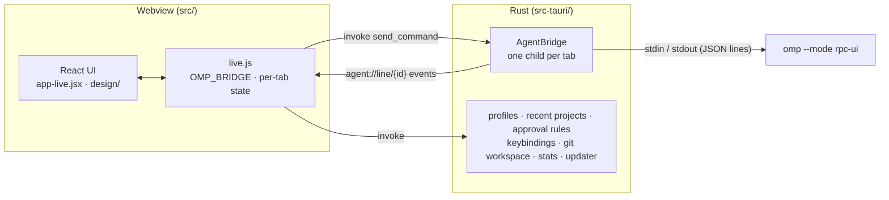
```mermaid
flowchart LR
  subgraph Webview["Webview (src/)"]
    UI["React UI<br/>app-live.jsx · design/"] <--> Bridge["live.js<br/>OMP_BRIDGE · per-tab state"]
  end
  subgraph Rust["Rust (src-tauri/)"]
    AB["AgentBridge<br/>one child per tab"]
    Svc["profiles · recent projects · approval rules<br/>keybindings · git workspace · stats · updater"]
  end
  Bridge -- "invoke send_command" --> AB
  AB -- "agent://line/{id} events" --> Bridge
  Bridge -- invoke --> Svc
  AB -- "stdin / stdout (JSON lines)" --> OMP["omp --mode rpc-ui"]
```

- **Rust** (`src-tauri/src/`): `agent/` spawns and supervises one `omp` per tab. That covers process groups and job objects, so a tab's whole tree dies with it; bounded stdout/stderr readers; and a per-session journal that replays what a background tab missed. Around it are small modules for profiles, recent projects, approval rules, keybindings, the git working tree, `omp stats`, saved sessions, OS folder-open requests and the updater.
- **Bridge** (`src/live.js`): all the RPC traffic. It keeps a registry of tabs, snapshots each tab's live state when you switch away, and exposes `window.OMP_BRIDGE` to React. `src/adapter.js` holds the pure transforms from RPC shapes to UI shapes.
- **UI** (`src/app-live.jsx`, `src/app/`, `src/design/`): React 19 without a bundler. Pure logic (keymap, project navigation, subagent reducer, updater state, session-title gates, …) lives in plain `src/app/*.js` modules, which the regression scripts in `tests/` load directly.

## License

[MIT](LICENSE)
